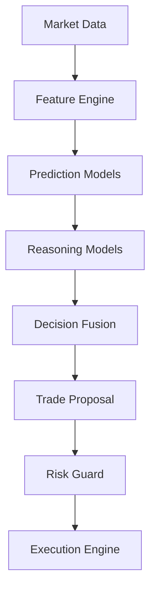

# QuantForge Intelligence Architecture

This document defines the long-term, highly modular AI and Machine Learning Architecture for the QuantForge platform. The design separates core market analytics, provider integrations, reasoning execution, risk safety boundaries, and validation tracks.

---

## 1. Trade Lifecycle Flow

All decision cycles execute strictly within a unidirectional, sandboxed pipeline. AI components and Large Language Models (LLMs) **never** communication directly with outer exchanges or execute trades directly.



1. **Market Data**: Raw candles and clock ticks.
2. **Feature Engine**: Standardizes indicator series and builds features snapshots.
3. **Prediction Models**: Outputs signals and scores (direction, volatility, target values).
4. **Reasoning Models**: Contextualizes prediction scores against macroeconomic, news, or portfolio states.
5. **Decision Fusion**: Reconciles and merges disparate model predictions.
6. **Trade Proposal**: Wraps decisions into a validated, immutable structure.
7. **Risk Guard**: Validates position sizing, exposure boundaries, and stop adjustments.
8. **Execution Engine**: Executes the trade via paper/live executor endpoints.

---

## 2. Intelligence Layer & Component Responsibilities

Every step in the decision pipeline is decoupled to prevent provider or model-specific lock-in.

- **Prediction Models**: Compute statistical forecasts without logic reasoning. They focus on directional tendencies (e.g., probability of upward movement), price intervals, and volatility regimes.
- **Reasoning Models**: Contextual analyze market conditions. Often powered by LLMs (e.g., Llama-3, Qwen-2.5, GPT-4o), they process qualitative data, correlate predictions, and evaluate context-bound risk.
- **Memory**: Supplies historical context. Keeps tracking of short-term strategy states, past decisions, and general agent conversations.
- **Knowledge**: Represents static or slow-moving reference facts (e.g., trading rules, correlation tables, timeframe mappings).
- **Decision Fusion**: A mathematical consensus layer (e.g., weighted voting, ensemble filters) that receives various predictions and reasoning outputs, filtering out low-consensus noise.
- **Confidence Engine**: Dynamically calculates confidence scores mapping to risk thresholds (e.g., only trading signals having >0.85 confidence confidence).
- **Trade Proposal Generation**: Synthesizes the final consensus trade schema consisting of action (BUY/SELL/HOLD), size, target entries, stop losses, and take profits.

---

## 3. Provider Abstraction Layer

The intelligence layer communicates with providers through an abstract interface block. This isolates underlying inference infrastructure from our decision workflow.

```
       +--------------------------------------------+
       |             Intelligence Layer             |
       +--------------------------------------------+
                             |
                   [ BaseProvider Interface ]
                             |
       +---------------------+----------------------+
       |                                            |
+--------------+                             +--------------+
| OllamaAgent  |                             |  vLLMAgent   |
+--------------+                             +--------------+
| HuggingFace  |                             | ONNXRuntime  |
+--------------+                             +--------------+
| OpenAI / Anth|                             |  llama.cpp   |
+--------------+                             +--------------+
```

- **Local Inference APIs**: Interfaces for `Ollama`, `llama.cpp` and `vLLM` to evaluate local models with high throughput.
- **Weights & Execution Libraries**: Hooks for `HuggingFace Transformers` and `ONNX Runtime` to run local classification or deep neural nets.
- **Cloud API Endpoints**: Managed providers like `OpenAI` or `Anthropic` for advanced reasoning and macro evaluations.

---

## 4. AI Contracts (Provider-Independent Schemas)

Every model and provider adapter must communicate using these decoupled constructs. Under no circumstances may provider-specific SDK payloads leak into other zones of QuantForge.

### PredictionRequest

Encapsulates all numeric features and metadata needed for inference.

```python
from typing import Dict, Any, List
from dataclasses import dataclass, field

@dataclass(frozen=True)
class PredictionRequest:
    symbol: str
    timeframe: str
    features: Dict[str, float]
    metadata: Dict[str, Any] = field(default_factory=dict)
```

### PredictionResponse

Encapsulates directional predictions, expected volatility, and model confidence scores.

```python
@dataclass(frozen=True)
class PredictionResponse:
    model_id: str
    predictions: Dict[str, float]  # e.g., {"probability_up": 0.72, "expected_returns": 0.05}
    confidence: float
```

### TradeProposal

Represents the concrete proposal generated by the Intelligence or Reasoning Layer.

```python
@dataclass(frozen=True)
class TradeProposal:
    symbol: str
    action: str  # BUY, SELL, HOLD
    confidence: float
    entry_price_limit: float | None
    stop_loss: float | None
    take_profit: float | None
    reasoning: str
```

### TradeDecision

The finalized, risk-checked trade command sent to the Execution Engine.

```python
@dataclass(frozen=True)
class TradeDecision:
    proposal_id: str
    action: str
    quantity: float
    entry_price: float
    stop_loss: float
    take_profit: float
    status: str  # APPROVED, REJECTED, ADJUSTED
    risk_notes: str
```

---

## 5. Memory Architecture

Intelligence relies on a structured memory hierarchy:

1. **Short-Term Conversation Memory**: Keeps context during single execution threads or user dialogue.
2. **Long-Term Trading Memory**: Captures transaction results and order execution histories across days/months.
3. **Strategy Memory**: Tracks stateful variables utilized by the strategy (e.g., current trailing stop levels, moving average crossovers).
4. **Experiment Memory**: Connected to `ExperimentTracker` to record grid search parameter configs and logs.
5. **Model Memory**: Backlist and checkpoints for active model checkpoints and active weights.

---

## 6. Multi-Agent Vision

Future extensions can introduce specialized trading agents collaborating through structured message passing under a unified supervisor:

```
                    +-------------------+
                    | Supervisor Agent  |
                    +-------------------+
                      /       |       \
                     /        |        \
          +-----------+ +-----------+ +-----------+
          | Technical | | Macro/News| | Portfolio |
          |   Agent   | |   Agent   | |   Agent   |
          +-----------+ +-----------+ +-----------+
                     \        |        /
                      \       |       /
                    +-------------------+
                    |    Risk Agent     |
                    +-------------------+
```

- **Technical Agent**: Specialized in pattern recognition, price action, and trend predictions.
- **News & Macro Agent**: Parses announcements, news sentiment, and economic indicator releases.
- **Portfolio Agent**: Optimizes weight allocations and asset correlation balancing.
- **Risk Agent**: Computes drawdown constraints, value-at-risk, and overall exposure.
- **Supervisor Agent**: Orchestrates agent messaging and aggregates proposals into a single clean TradeProposal.

---

## 7. AI Evaluation (Shadow Mode Readiness)

Before any AI model can trade live capital, it must pass a multi-stage validation track:

```
[ WFA Backtesting ] --> [ Parameter Optimization ] --> [ Experiment Tracking Logs ] --> [ Shadow Mode (Staging) ] --> [ Live Production ]
```

1. **Walk Forward Analysis**: Validations across non-overlapping historical windows to ensure lack of overfitting.
2. **Parameter Optimization**: Grid search to fine-tune score boundaries and thresholds.
3. **Experiment Tracking**: Automatic persistence of all backtest configuration iterations for audit comparisons.
4. **Shadow Mode**: Running in staging environments where the model generates live proposals but trades are not executed. Performance metrics on slippage, latency, and drawdown are benchmarked before graduating to live production.
