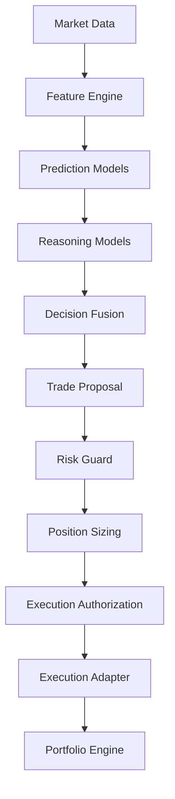

# QuantForge Intelligence Architecture

This document defines the long-term, highly modular AI and Machine Learning Architecture for the QuantForge platform. The design separates core market analytics, provider integrations, reasoning execution, risk safety boundaries, and validation tracks.

---

## 1. Trade Lifecycle Flow

All decision cycles execute strictly within a unidirectional, sandboxed pipeline. AI components and Large Language Models (LLMs) **never** communication directly with outer exchanges or execute trades directly.



1. **Market Data**: Raw candles and clock ticks.
2. **Feature Engine**: Standardizes indicator series and builds features snapshots.
3. **Prediction Models**: Outputs signals and scores (direction, volatility, target values).
4. **Reasoning Models**: Contextualizes prediction scores against macroeconomic, news, or portfolio states.
5. **Decision Fusion**: Reconciles and merges disparate model predictions.
6. **Trade Proposal**: Wraps decisions into a validated, immutable structure.
7. **Risk Guard**: Validates position sizing, exposure boundaries, and stop adjustments.
8. **Position Sizing**: Dynamically calculates order quantities based on authorized risk fractions and entry/stop distances.
9. **Execution Authorization**: Evaluates execution enable status, daily limits, and issue order intents.
10. **Execution Adapter**: Simulates paper executions or passes fills to live exchange adapters.
11. **Portfolio Engine**: Ingests execution result fills atomically to maintain positions, balances, high-water marks, and PnL accounting.

---

## 2. Intelligence Layer & Component Responsibilities

Every step in the decision pipeline is decoupled to prevent provider or model-specific lock-in.

- **Prediction Models**: Compute statistical forecasts without logic reasoning. They focus on directional tendencies (e.g., probability of upward movement), price intervals, and volatility regimes.
- **Reasoning Models**: Contextual analyze market conditions. Often powered by LLMs (e.g., Llama-3, Qwen-2.5, GPT-4o), they process qualitative data, correlate predictions, and evaluate context-bound risk.
- **Memory**: Supplies historical context. Keeps tracking of short-term strategy states, past decisions, and general agent conversations.
- **Knowledge**: Represents static or slow-moving reference facts (e.g., trading rules, correlation tables, timeframe mappings).
- **Decision Fusion**: A mathematical consensus layer (e.g., weighted voting, ensemble filters) that receives various predictions and reasoning outputs, filtering out low-consensus noise.
- **Confidence Engine**: Dynamically calculates confidence scores mapping to risk thresholds (e.g., only trading signals having >0.85 confidence confidence).
- **Trade Proposal Generation**: Synthesizes the final consensus trade schema consisting of action (BUY/SELL/HOLD), size, target entries, stop losses, and take profits.
- **Risk Guard**: A deterministic, fail-closed system that authorizes TradeProposals against drawdown constraints, volatility gates, and max-allowable risk budgets.
- **Position Sizing**: A deterministic, math-exact capital allocation engine that calculates order quantities based on authorized risk fractions and context-level entry/stop-loss distances.

---

## 3. Provider Abstraction Layer

The intelligence layer communicates with providers through an abstract interface block. This isolates underlying inference infrastructure from our decision workflow.

```
       +--------------------------------------------+
       |             Intelligence Layer             |
       +--------------------------------------------+
                             |
                   [ BaseProvider Interface ]
                             |
       +---------------------+----------------------+
       |                                            |
+--------------+                             +--------------+
| OllamaAgent  |                             |  vLLMAgent   |
+--------------+                             +--------------+
| HuggingFace  |                             | ONNXRuntime  |
+--------------+                             +--------------+
| OpenAI / Anth|                             |  llama.cpp   |
+--------------+                             +--------------+
```

- **Local Inference APIs**: Interfaces for `Ollama`, `llama.cpp` and `vLLM` to evaluate local models with high throughput.
- **Weights & Execution Libraries**: Hooks for `HuggingFace Transformers` and `ONNX Runtime` to run local classification or deep neural nets.
- **Cloud API Endpoints**: Managed providers like `OpenAI` or `Anthropic` for advanced reasoning and macro evaluations.

---

## 4. AI Contracts (Provider-Independent Schemas)

Every model and provider adapter must communicate using these decoupled constructs. Under no circumstances may provider-specific SDK payloads leak into other zones of QuantForge.

### PredictionRequest

Encapsulates all numeric features and metadata needed for inference.

```python
from typing import Dict, Any, List
from dataclasses import dataclass, field

@dataclass(frozen=True)
class PredictionRequest:
    symbol: str
    timeframe: str
    features: Dict[str, float]
    metadata: Dict[str, Any] = field(default_factory=dict)
```

### PredictionResponse

Encapsulates directional predictions, expected volatility, and model confidence scores.

```python
@dataclass(frozen=True)
class PredictionResponse:
    model_id: str
    predictions: Dict[str, float]  # e.g., {"probability_up": 0.72, "expected_returns": 0.05}
    confidence: float
```

### TradeProposal

Represents the concrete proposal generated by the Intelligence or Reasoning Layer.

```python
@dataclass(frozen=True)
class TradeProposal:
    symbol: str
    action: str  # BUY, SELL, HOLD
    confidence: float
    entry_price_limit: float | None
    stop_loss: float | None
    take_profit: float | None
    reasoning: str
```

### TradeDecision

The finalized, risk-checked trade command sent to the Execution Engine.

```python
@dataclass(frozen=True)
class TradeDecision:
    proposal_id: str
    action: str
    quantity: float
    entry_price: float
    stop_loss: float
    take_profit: float
    status: str  # APPROVED, REJECTED, ADJUSTED
    risk_notes: str
```

### 4.5 Intelligence & Reasoning Layer Contracts (Sprint 2.9)

QuantForge Reasoning Engine and AI provider runtimes communicate using these provider-independent domain dataclasses under `backend/intelligence/models.py`:

```python
@dataclass
class AIRequest:
    request_id: str
    task_type: str
    system_prompt: str
    user_prompt: str
    context: Optional[Dict[str, Any]] = None
    temperature: float = 0.0
    max_tokens: Optional[int] = None
    response_schema: Optional[Dict[str, Any]] = None
    metadata: Dict[str, Any] = field(default_factory=dict)

@dataclass
class AIResponse:
    request_id: str
    provider: str
    model: str
    content: str
    structured_output: Optional[Dict[str, Any]] = None
    latency_ms: float = 0.0
    success: bool = True
    error: Optional[str] = None
    metadata: Dict[str, Any] = field(default_factory=dict)

@dataclass
class ReasoningRequest:
    symbol: str
    timeframe: str
    timestamp: str
    features: Dict[str, Any]
    ml_predictions: Dict[str, Any]
    market_context: Dict[str, Any]
    portfolio_context: Dict[str, Any]
    risk_context: Dict[str, Any]
    additional_context: Dict[str, Any] = field(default_factory=dict)

@dataclass
class ReasoningResult:
    market_regime: str
    directional_bias: str
    confidence: float  # Bounded strictly [0.0, 1.0]
    risk_flags: List[str]
    reasoning_summary: str
    evidence: List[str]
    provider: str
    model: str
    latency_ms: float
    request_id: str
    prompt_id: str
    prompt_version: str
    timestamp: str

@dataclass
class ProviderHealth:
    available: bool
    provider: str
    model: str
    latency_ms: float
    error: Optional[str] = None
```

### 4.6 Risk Guard & Trade Authorization Contracts (Sprint 3.1)

Risk authorization layer structures under `backend/risk/models.py`:

```python
@dataclass(frozen=True)
class RiskContext:
    symbol: str
    current_equity: float
    current_multiplier: float
    max_portfolio_drawdown: float
    daily_drawdown_limit: float
    volatility_threshold: float
    pending_risk_fraction: float
    current_drawdown: float
    timestamp: str

@dataclass(frozen=True)
class RiskAuthorizationResult:
    authorization_id: str
    proposal_id: str
    symbol: str
    direction: str
    status: RiskAuthorizationStatus  # APPROVED, REJECTED, ADJUSTED
    original_confidence: float
    effective_confidence: float
    rejection_reasons: List[str]
    adjustment_reasons: List[str]
    triggered_rules: List[str]
    policy_version: str
    source_model_version: str
    fusion_policy_version: str
    proposal_created_at: str
    evaluated_at: str
    latency_ms: float
    requested_risk_fraction: float
    authorized_risk_fraction: float
```

### 4.7 Position Sizing & Capital Allocation Contracts (Sprint 3.2)

Position sizing contracts under `backend/positioning/models.py`:

```python
@dataclass(frozen=True)
class PositionSizingContext:
    symbol: str
    instrument_type: str  # spot, linear_perpetual
    equity: float
    available_balance: float
    entry_price: float
    stop_loss_price: float
    market_price: float
    leverage: float
    contract_size: float
    lot_size: float
    min_quantity: float
    max_quantity: float
    quantity_step: float
    price_tick: float
    current_symbol_exposure: float
    current_portfolio_exposure: float
    market_timestamp: str
    timestamp: str

@dataclass(frozen=True)
class PositionSizeResult:
    sizing_id: str
    proposal_id: str
    symbol: str
    direction: str
    quantity: float
    position_notional: float
    entry_price: float
    stop_loss_price: float
    stop_distance_absolute: float
    stop_distance_fraction: float
    authorized_risk_fraction: float
    risk_amount: float
    leverage: float
    estimated_margin_required: float
    policy_version: str
    created_at: str
    authorization_id: Optional[str]
    source_model_version: str
    metadata: Dict[str, Any] = field(default_factory=dict)
```

### 4.8 Execution Authorization Contracts (Sprint 3.3)

Execution Authorization schemas under `backend/execution_authorization/models.py`:

```python
@dataclass(frozen=True)
class ExecutionContext:
    environment: ExecutionEnvironment
    current_timestamp: str  # ISO 8601
    market_timestamp: str   # ISO 8601
    execution_enabled: bool
    kill_switch_active: bool
    symbol_trading_enabled: bool
    available_balance: float
    current_price: float
    metadata: Dict[str, Any] = field(default_factory=dict)

@dataclass(frozen=True)
class OrderIntent:
    intent_id: str
    idempotency_key: str
    proposal_id: str
    risk_authorization_id: str
    sizing_id: str
    symbol: str
    direction: OrderDirection
    quantity: float
    order_type: OrderType
    limit_price: Optional[float] = None
    stop_loss: Optional[float] = None
    take_profit: Optional[float] = None
    environment: ExecutionEnvironment = ExecutionEnvironment.PAPER
    source_model_version: str = ""
    fusion_policy_version: str = ""
    risk_policy_version: str = ""
    position_sizing_policy_version: str = ""
    execution_policy_version: str = ""
    reasoning_request_id: Optional[str] = None
    created_at: str = ""
    expires_at: str = ""

@dataclass(frozen=True)
class ExecutionAuthorizationResult:
    authorization_id: str
    status: ExecutionAuthorizationStatus
    intent: Optional[OrderIntent] = None
    rejection_reason: str = ""
    triggered_rules: List[str] = field(default_factory=list)
    proposal_id: str = ""
    risk_authorization_id: str = ""
    sizing_id: str = ""
    latency_ms: float = 0.0
    timestamp: str = ""
    metadata: Dict[str, Any] = field(default_factory=dict)
```

### 4.9 Execution Adapter & Simulation Engine Contracts (Sprint 3.4)

Execution Simulation schemas under `backend/execution_adapter/models.py`:

```python
class ExecutionStatus(Enum):
    ACCEPTED = "ACCEPTED"
    FILLED = "FILLED"
    PARTIALLY_FILLED = "PARTIALLY_FILLED"
    REJECTED = "REJECTED"
    CANCELLED = "CANCELLED"
    EXPIRED = "EXPIRED"

@dataclass(frozen=True)
class Fill:
    fill_id: str
    intent_id: str
    symbol: str
    direction: OrderDirection
    quantity: float
    price: float
    notional: float
    fee: float
    slippage_amount: float
    timestamp: str  # ISO 8601
    metadata: Dict[str, Any] = field(default_factory=dict)

@dataclass(frozen=True)
class ExecutionResult:
    execution_id: str
    intent_id: str
    proposal_id: str
    risk_authorization_id: str
    sizing_id: str
    symbol: str
    direction: OrderDirection
    requested_quantity: float
    filled_quantity: float
    average_fill_price: float
    total_notional: float
    total_fees: float
    total_slippage: float
    status: ExecutionStatus
    fills: List[Fill]
    rejection_reason: str
    adapter_name: str
    environment: ExecutionEnvironment
    started_at: str  # ISO 8601
    completed_at: str  # ISO 8601
    latency_ms: float
    policy_version: str
    metadata: Dict[str, Any] = field(default_factory=dict)

@dataclass(frozen=True)
class PaperExecutionContext:
    current_market_price: float
    bid_price: float
    ask_price: float
    available_liquidity: float
    timestamp: str  # ISO 8601
    metadata: Dict[str, Any] = field(default_factory=dict)
```

### 4.10 Portfolio, Position & Accounting Contracts (Sprint 3.5)

Portfolio, Position, and Snapshot contracts under `backend/portfolio/models.py`:

```python
class PositionSide(Enum):
    LONG = "LONG"
    SHORT = "SHORT"

@dataclass(frozen=True)
class Position:
    position_id: str
    symbol: str
    side: PositionSide
    quantity: Decimal
    average_entry_price: Decimal
    current_price: Decimal
    position_notional: Decimal
    unrealized_pnl: Decimal
    realized_pnl: Decimal
    accumulated_fees: Decimal
    leverage: Decimal
    margin_used: Decimal
    opened_at: str
    updated_at: str
    source_execution_ids: List[str]
    source_fill_ids: List[str]
    metadata: Dict[str, Any]

@dataclass(frozen=True)
class PortfolioState:
    portfolio_id: str
    initial_balance: Decimal
    cash_balance: Decimal
    equity: Decimal
    realized_pnl: Decimal
    unrealized_pnl: Decimal
    total_fees: Decimal
    used_margin: Decimal
    available_balance: Decimal
    gross_exposure: Decimal
    net_exposure: Decimal
    open_position_count: int
    positions: Mapping[str, Position]
    timestamp: str
    metadata: Dict[str, Any]

@dataclass(frozen=True)
class PortfolioSnapshot:
    portfolio_id: str
    initial_balance: Decimal
    cash_balance: Decimal
    equity: Decimal
    realized_pnl: Decimal
    unrealized_pnl: Decimal
    total_fees: Decimal
    used_margin: Decimal
    available_balance: Decimal
    gross_exposure: Decimal
    net_exposure: Decimal
    open_positions: List[Position]
    timestamp: str
    metadata: Dict[str, Any]
```

### 4.11 Position Lifecycle Management Contracts (Sprint 3.6)

Coordinates protective bounds adjustments and exit proposals under `backend/position_lifecycle/models.py`:

```python
class PositionLifecycleStatus(Enum):
    OPEN = "OPEN"
    CLOSING = "CLOSING"
    CLOSED = "CLOSED"

class ProtectiveTriggerType(Enum):
    STOP_LOSS = "STOP_LOSS"
    TAKE_PROFIT = "TAKE_PROFIT"
    TRAILING_STOP = "TRAILING_STOP"
    MANUAL_EXIT = "MANUAL_EXIT"

class ExitReason(Enum):
    STOP_LOSS_TRIGGERED = "STOP_LOSS_TRIGGERED"
    TAKE_PROFIT_TRIGGERED = "TAKE_PROFIT_TRIGGERED"
    TRAILING_STOP_TRIGGERED = "TRAILING_STOP_TRIGGERED"
    MANUAL_EXIT = "MANUAL_EXIT"
    RISK_EXIT = "RISK_EXIT"

@dataclass(frozen=True)
class ProtectivePositionState:
    lifecycle_id: str
    position_id: str
    symbol: str
    side: PositionSide
    quantity: Decimal
    average_entry_price: Decimal
    stop_loss: Optional[Decimal]
    take_profit: Optional[Decimal]
    trailing_stop_enabled: bool
    trailing_distance: Optional[Decimal]
    trailing_activation_price: Optional[Decimal]
    highest_price_since_entry: Optional[Decimal]
    lowest_price_since_entry: Optional[Decimal]
    active_trailing_stop_price: Optional[Decimal]
    status: PositionLifecycleStatus
    created_at: str
    updated_at: str
    metadata: Dict[str, Any] = field(default_factory=dict)

@dataclass(frozen=True)
class ExitProposal:
    exit_proposal_id: str
    lifecycle_id: str
    position_id: str
    symbol: str
    position_side: PositionSide
    exit_direction: OrderDirection
    requested_quantity: Decimal
    trigger_type: ProtectiveTriggerType
    exit_reason: ExitReason
    trigger_price: Decimal
    market_price: Decimal
    source_stop_loss: Optional[Decimal]
    source_take_profit: Optional[Decimal]
    source_trailing_stop: Optional[Decimal]
    created_at: str
    expires_at: str
    lifecycle_policy_version: str
    source_execution_id: str
    metadata: Dict[str, Any] = field(default_factory=dict)
```

---

## 5. Memory Architecture

Intelligence relies on a structured memory hierarchy:

1. **Short-Term Conversation Memory**: Keeps context during single execution threads or user dialogue.
2. **Long-Term Trading Memory**: Captures transaction results and order execution histories across days/months.
3. **Strategy Memory**: Tracks stateful variables utilized by the strategy (e.g., current trailing stop levels, moving average crossovers).
4. **Experiment Memory**: Connected to `ExperimentTracker` to record grid search parameter configs and logs.
5. **Model Memory**: Backlist and checkpoints for active model checkpoints and active weights.

---

## 6. Multi-Agent Vision

Future extensions can introduce specialized trading agents collaborating through structured message passing under a unified supervisor:

```
                    +-------------------+
                    | Supervisor Agent  |
                    +-------------------+
                      /       |       \
                     /        |        \
          +-----------+ +-----------+ +-----------+
          | Technical | | Macro/News| | Portfolio |
          |   Agent   | |   Agent   | |   Agent   |
          +-----------+ +-----------+ +-----------+
                     \        |        /
                      \       |       /
                    +-------------------+
                    |    Risk Agent     |
                    +-------------------+
```

- **Technical Agent**: Specialized in pattern recognition, price action, and trend predictions.
- **News & Macro Agent**: Parses announcements, news sentiment, and economic indicator releases.
- **Portfolio Agent**: Optimizes weight allocations and asset correlation balancing.
- **Risk Agent**: Computes drawdown constraints, value-at-risk, and overall exposure.
- **Supervisor Agent**: Orchestrates agent messaging and aggregates proposals into a single clean TradeProposal.

---

## 7. AI Evaluation (Shadow Mode Readiness)

Before any AI model can trade live capital, it must pass a multi-stage validation track:

```
[ WFA Backtesting ] --> [ Parameter Optimization ] --> [ Experiment Tracking Logs ] --> [ Shadow Mode (Staging) ] --> [ Live Production ]
```

1. **Walk Forward Analysis**: Validations across non-overlapping historical windows to ensure lack of overfitting.
2. **Parameter Optimization**: Grid search to fine-tune score boundaries and thresholds.
3. **Experiment Tracking**: Automatic persistence of all backtest configuration iterations for audit comparisons.
4. **Shadow Mode**: Running in staging environments where the model generates live proposals but trades are not executed. Performance metrics on slippage, latency, and drawdown are benchmarked before graduating to live production.
