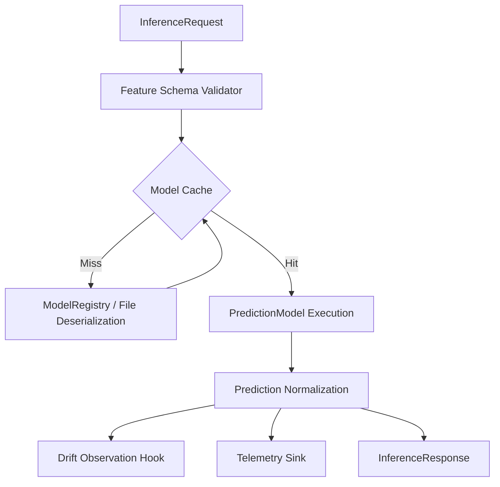

# QuantForge Machine Learning Research Review (Sprint 2.8.1)

This document provides a rigorous academic and institutional review of the machine learning algorithms, design choices, trade-offs, and risk factors associated with the newly implemented QuantForge Model Training Platform.

---

## 1. Algorithm Selection: Tabular GBDTs

QuantForge initially supports **LightGBM**, **XGBoost**, and **CatBoost**. These gradient-boosted decision tree (GBDT) frameworks represent the state-of-the-art for tabular market data.

### Why Decision Trees Over Deep Learning?

- **Feature Representability**: Heterogeneous indicator fields (RSI, EMA) must be processed natively. GBDTs handle multi-scale inputs dynamically without massive scaling preparation.
- **Robustness to Noise**: GBDTs ignore non-informative features through automatic split optimization, vital in low signal-to-noise ratio market regimes.
- **Execution Efficiency**: Iterative model exploration needs lightweight training steps that execute in seconds/minutes without GPU dependencies.

### Algorithm-Specific Strengths

1. **LightGBM**: Fast training via Gradient-based One-Side Sampling (GOSS) and Exclusive Feature Bundling (EFB).
2. **XGBoost**: Regularized objective functions ($L_1$/$L_2$) prevent overfitting. Very robust cache-aware partitioning.
3. **CatBoost**: Excels at handling categorical attributes natively (using symmetric trees) and combats target leakage.

---

## 2. Risk & Leakage Analysis

In financial machine learning, data leakage is the single most common cause of backtest outperformance that fails catastrophically in live trading.

### Data Leakage Sources & Prevention

- **Causal Feature Computations**: Technical indicators are computed sequentially using strict causal lookbacks.
- **Temporal Splitting Schemes**:

  | Method CV                      | Chronological | Multi-Fold / Low Variance | Handles Future Horizons ($H$)  | Serial Correlation Insulation ($E$) |
  | ------------------------------ | :-----------: | :-----------------------: | :----------------------------: | :---------------------------------: |
  | **Chronological Single Split** |      Yes      |            No             |               No               |                 No                  |
  | **Ordinary TimeSeriesSplit**   |      Yes      |      Yes (expanding)      |      No (severe leakage)       |                 No                  |
  | **Walk Forward Analysis**      |      Yes      |       Yes (rolling)       |               No               |                 No                  |
  | **Purged Cross Validation**    |      Yes      |    Yes (K-fold blocks)    | **Yes (removes left overlap)** |                 No                  |
  | **Purged CV + Embargo**        |      Yes      |    Yes (K-fold blocks)    | **Yes (removes left overlap)** |   **Yes (removes right overlap)**   |

#### Purged Cross-Validation with Embargo

Chronological division where validation slice is fold $k$ and training is all other folds.

- To prevent overlap leakage from future-looking labels of duration $H$, we purge training samples in window $[v_{\text{start}} - H, \ v_{\text{start}} - 1]$.
- To prevent autocorrelation leakages after validation folds, we embargo training inputs in range $[v_{\text{end}}, \ v_{\text{end}} + E - 1]$.

---

### Class Imbalance Analysis

- **Risk**: Market target returns are naturally sparse. Classifiers easily learn majority class trivial rules.
- **Mitigation**: `DatasetValidator` enforces a $5\%$ minority threshold checked before fitting, and hyperparameter balances are configured in `TrainingConfig`.

### Overfitting & Generalization Risks

- **Overfitting Indicators**: A substantial gap between train performance (e.g., F1 $= 0.95$) and val/test performance (e.g., F1 $= 0.51$) points to overfitting.
- **Mitigation**:
  - Regularization hyperparameters ($L_1/L_2$ penalties, `max_depth`, `min_child_weight`) are tuned systematically.
  - Candidate status validation threshold prevents weak or overfitted models from progressing to shadow execution pipelines.

---

## 3. Institutional Model Validation Framework (Sprint 2.7)

### Why Financial Validation Differs from ML Validation

Generic ML validation checks static errors (e.g. classification F1 score, Accuracy, MAE). Financial time-series, however, are highly path-dependent and subject to structural regime shifts. A classifier with $60\%$ accuracy can lose money if:

1. It suffers from consecutive losing trade clusters (leading to catastrophic drawdown).
2. It generates signals that decay immediately when execution speed or latency is introduced.
3. Its trades occur during low-liquidity regimes.

For this reason, QuantForge enforces **financial verification gates** (drawdown limits, net profit baselines, Sharpe ratio minimums) executed causality-safe over rolling walk-forward windows.

### Benchmark Philosophy

To justify complex multi-parameter GBDTs (XGBoost/LightGBM/CatBoost), models must out-perform standard trading benchmarks:

- **Buy & Hold**: Benchmarks beta returns.
- **Always Flat**: Validates net profit is greater than holding zero positions (guards against negative PnL).
- **Random Predictor**: Guards against luck/random signals.
- **Micro Technical Baselines (EMA, RSI, MACD)**: Verifies that complex nonlinear models generate alpha beyond standard technical indicators.

### Stability & Stress Scoring

A model's performance under frictionless conditions is a phantom. Our stability testing applies:

- **Execution Slippage**: Alters entries and exits by adding $0.1\%$ to $0.3\%$ friction.
- **Commissions**: Deducts fixed exchange transaction fees.

We divide the stress performance by baseline performance to produce a **Stability Score**. If a model's stability drops below $70\%$, it signifies that the underlying signals have low profit margins and are highly sensitive to market shocks.

---

## 4. Real-Time ML Inference Engine (Sprint 2.8)

### Inference Runtime Design

The real-time ML inference engine provides isolated prediction execution for validated models model-version pinned in the registry. It decouples the forecasting layer from trade execution logic, ensuring that the ML model's only responsibility is generating signal probabilities and predictions from feature inputs.

### Key Architectural Guards

1. **Isolation of Trade Execution**: The inference engine has no capability to execute orders or create trade proposals. It converts raw inputs into normalized predictions, preventing code couplings.
2. **Fail-Closed Verification**: If feature inputs contain NaNs, infinities, or invalid column names/ordering, the engine throws a structured `InferenceError` subtype. It does not return default/fallback predictions.
3. **Database-backed Lifecycle Invalidation**: Before any prediction is executed, even if the model is cached in memory, its active state is verified against the registry database. When a model's lifecycle status transitions to `DEPRECATED` or `ARCHIVED`, it is immediately blocked from inference.
4. **Calibrated vs Uncalibrated Predictors**: Classification outputs contain metadata detailing whether probabilities are calibrated, uncalibrated, or unavailable. Regression targets exclude fabricated confidences.

---

## 5. Institutional Readiness Assessment

### Current Status

**Approved for Staging / Real-Time Inference Validation**

## 5. Probability Calibration & Drift Research (Sprint 2.8.1)

### Probability Calibration

Raw classifier outputs are often uncalibrated. Calibrated probabilities are required for thresholding, sizing, and risk checks:

- **Platt Scaling**: Fits a logistic regression model on raw model predictions. Highly effective parametric method.
- **Isotonic Regression**: Fits a non-parametric monotonic stepwise function. Best for larger sample sizes.
  Both methods are fit exclusively on OOF/validation data to avoid leakage. ECE, Brier, and Log Loss metrics are evaluated post-calibration.

### Active Feature Drift Detection

Covariate drift degrades accuracy.

- **Population Stability Index (PSI)**: Evaluates shifts between validation baselines and real-time streaming feature distributions. Uses Laplace smoothing ($1e-4$).
- **Kolmogorov-Smirnov (KS) Test**: Non-parametric check for variance, degrading gracefully if baselines are missing.

---

## 6. Institutional Readiness Assessment

The platform achieves a robust, grade-A software foundation:

- **Isolated Inference Engine**: Unified `InferenceEngine` handling validations, cache reload/invalidation, and telemetry reporting.
- **Calibrated Inference Trust Chain**: Enforces SHA-256 weight verification, Platt/Isotonic probability calibration, and active feature drift checks.
- **Generalizability**: Chronological purged cross-validation with embargo blocks data leakage, preventing overfitting on overlapping label horizons.
- **Quality Assurance**: Complete validation of data quality prior to executing fit loops prevents trash-in-trash-out failures.
